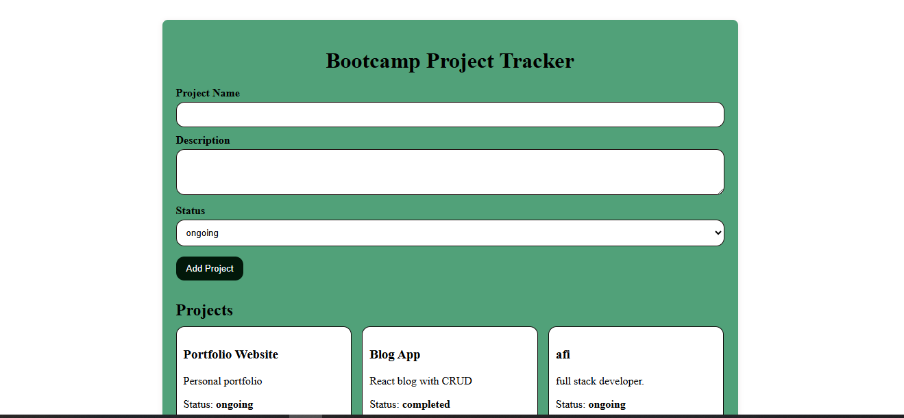
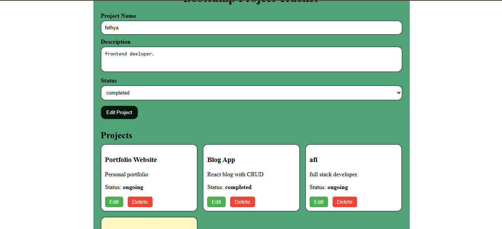
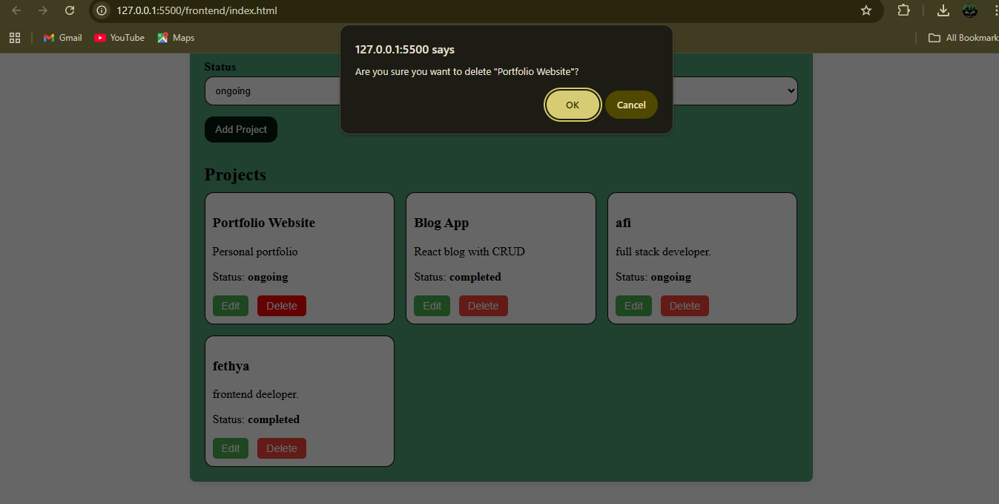
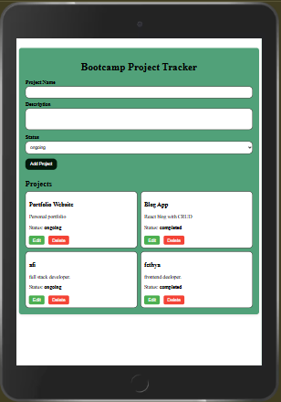
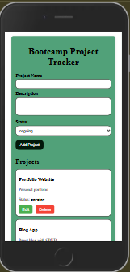

# 🚀 Bootcamp Project Tracker

A simple CRUD web app built with Node.js + Express (backend) and HTML/CSS/JS (frontend). This app lets you add, edit, delete, and track projects.

---

## 📂 Project Structure

```
bootcamp-project-tracker/
│── backend/
│   ├── controllers/
│   │   └── projectController.js   # Handles request logic
│   ├── data/
│   │   └── projectData.js         # In-memory array (mock DB)
│   ├── routes/
│   │   └── projectRoutes.js       # API endpoints
│   ├── services/
│   │   └── projectService.js      # Business logic
│   ├── server.js                  # Express app entry point
│   └── .env                       # Environment variables (PORT, APP_NAME)
│   │──node_modules/
│   │──package-lock.json
│   │──package.json
│
│── frontend/
│   ├── index.html                 # UI
│   ├── style.css                  # Styles
│   └── app.js                     # Frontend logic (fetch API, DOM updates)
│
│── README.md
```

---

## ⚙️ Setup Instructions

1️⃣ **Clone the repository**

```bash
git clone https://github.com/your-username/bootcamp-project-tracker.git
cd bootcamp-project-tracker
```

2️⃣ **Install backend dependencies**

```bash
cd backend
npm install
```

3️⃣ **Create **\*\*\***\*\*\*\*\***\*\*\***\*`.env`**\*\*\*\***\*\*\*\***\*\*\*\*\*\* file\*\*
Inside `backend/.env`:

```
PORT=3000
APP_NAME=BootcampProjectTracker
```

4️⃣ **Start the backend**

```bash
npm start
```

✅ Server will run at: [http://localhost:3000](http://localhost:3000)
✅ API base: [http://localhost:3000/api/projects](http://localhost:3000/api/projects)

5️⃣ **Run the frontend**
Simply open `frontend/index.html` in your browser (or serve with Live Server in VS Code).

---

## 🔗 API Endpoints

| Method | Endpoint           | Description             |
| ------ | ------------------ | ----------------------- |
| GET    | /api/projects      | Get all projects        |
| GET    | /api/projects/\:id | Get a project by ID     |
| POST   | /api/projects      | Add new project         |
| PUT    | /api/projects/\:id | Update existing project |
| DELETE | /api/projects/\:id | Delete a project        |

---

## 🖼️ UI Screenshots

**Home Page:**  


**Edit Project:**  


**Delete Project:**  


**Responsive Design1:**  


**Responsive Design:**  


---

## 📱 Responsive Design

- ✅ Desktop → Grid view (3 columns)
- ✅ Tablet → 2 columns
- ✅ Mobile → Single column

---

## 📝 Postman API Testing Guide

1. **Download and Install Postman** from [https://www.postman.com/](https://www.postman.com/)

2. **Create a New Request**

   - Click `New` → `HTTP Request` or the `+` tab.

3. **Choose HTTP Method**

   - GET → fetch data
   - POST → create new project
   - PUT → update project
   - DELETE → remove project

4. **Enter API URL**

```
http://localhost:3000/api/projects
```

5. **Add Headers (for POST/PUT)**

```
Content-Type: application/json
```

6. **Add Body (for POST/PUT)**

- Choose `Body` → `raw` → JSON

```json
{
  "name": "New Project",
  "description": "Project description",
  "status": "ongoing"
}
```

7. **Send Request**

   - Click `Send` and see the response body, status code, and response time.

8. **Example Workflow**

   - GET `http://localhost:3000/api/projects` → fetch all projects
   - POST `http://localhost:3000/api/projects` → add project
   - PUT `http://localhost:3000/api/projects/1` → update project with ID 1
   - DELETE `http://localhost:3000/api/projects/1` → delete project with ID 1

9. **Save Requests** in a collection to reuse and organize your API testing.

---

## 🚀 Future Improvements

- Store data in a real database (MongoDB / PostgreSQL)
- Add authentication (login/signup)
- Deploy backend + frontend online

---

## 👨‍💻 Author

Fethya Awol

📫 Contact
fethyaawol@gmail.com
